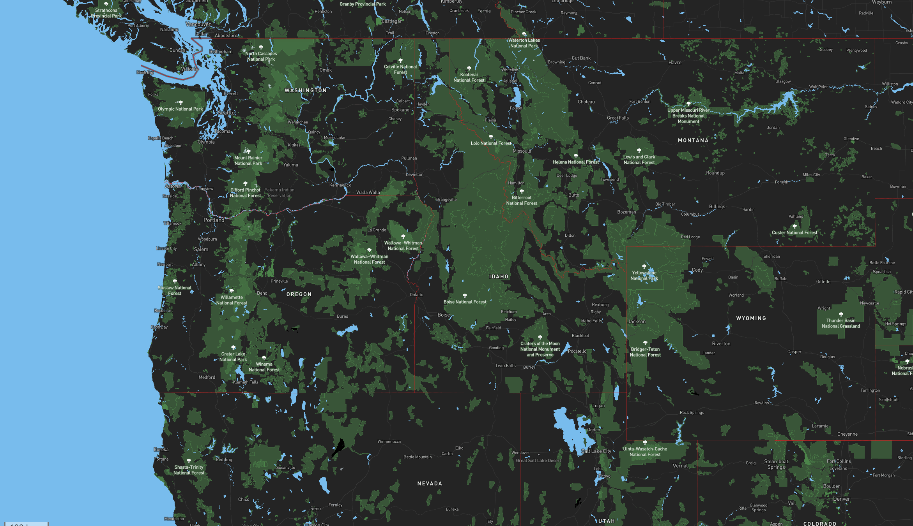
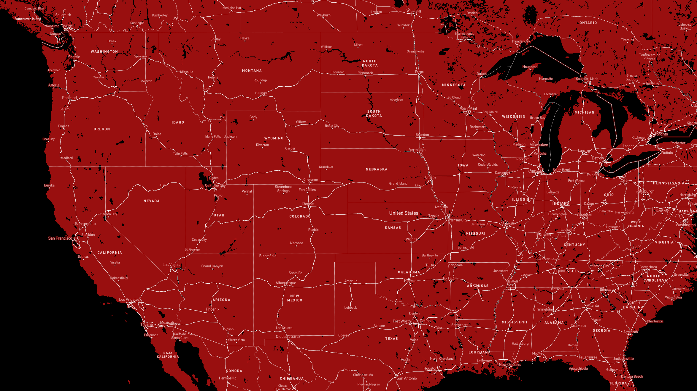
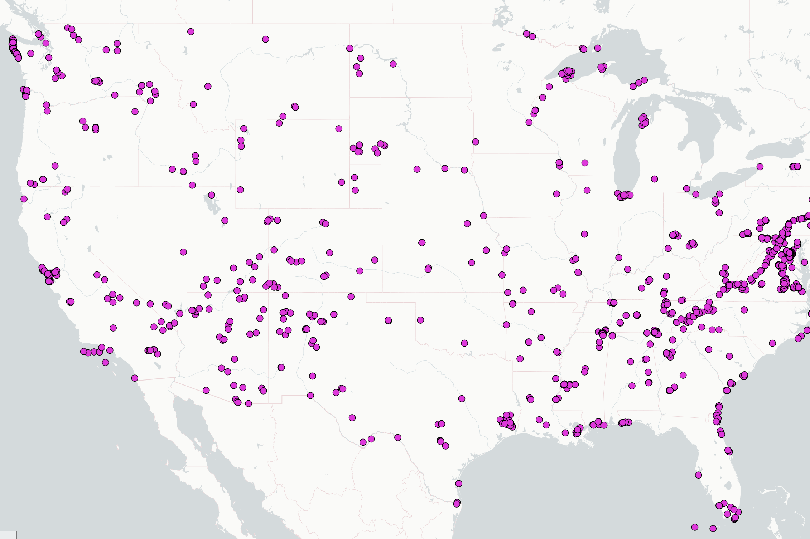
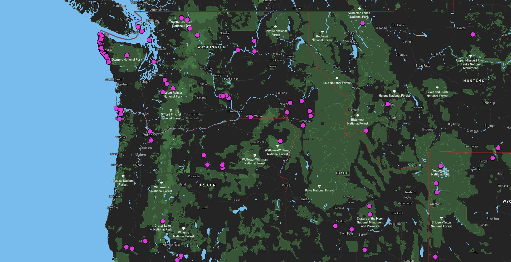

# Lab 4:QMetaTile

**By:** Chase Verbout, chase27@uw.edu
**Access the map:** https://cverbout.github.io/QMetaTiles/

The area for observation in these maps is the United States. Starting at a very broad country-wide focus and allowing the user to zoom in to a broad state level view.

The zoom capabilites afforded by this map range from minimum of 4 to a maximum of 7. At 4 there is a general view of the United States showing all 48 landlocked states. Moving to 7 the user can center a whole state on their screen providing a more specific focus. Each tile set is capable of meeting this range of 4 to 7 which was determined to be the optimal range for the data that is presented.

**Tile Set 1:** Dark Terrain

A dark themed basemap that emphasizes water and greenspace with bright coloring.
- Black, Light Blue, Green
 

**Tile Set 2:** Portland Trail Blazers Theme

A map styled to represent the core colors of the Portland Trail Blazers (NBA team).
- Black, Red, and White
 

**Tile Set 3:** National Park Service

A data set provided by the National Park Service. Displays the boundary centroid for National Parks in the United States. 100% transparent background allows this to be used on any basemap.
  - Purple Dots
 

**Tile Set 4:** National Park Service with Dark Terrain

A map combining the basemap in tile set 1 and the data in tile set 3.
- Black, Light Blue, Green
- Purple Dots
